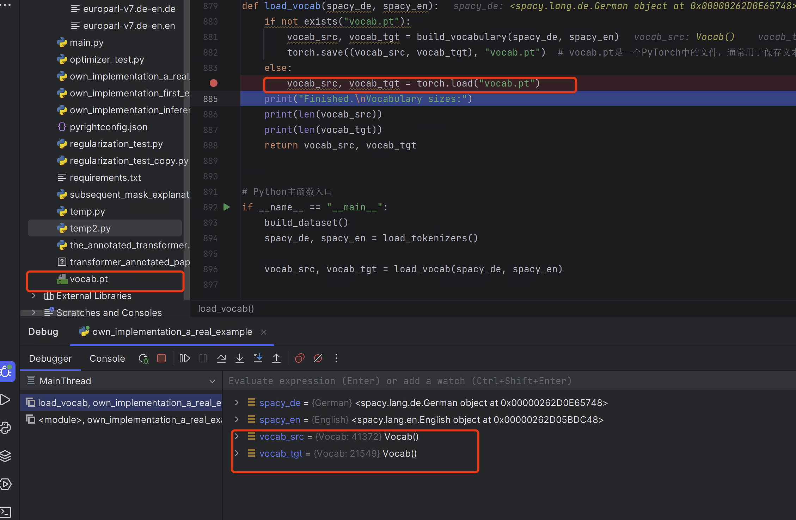
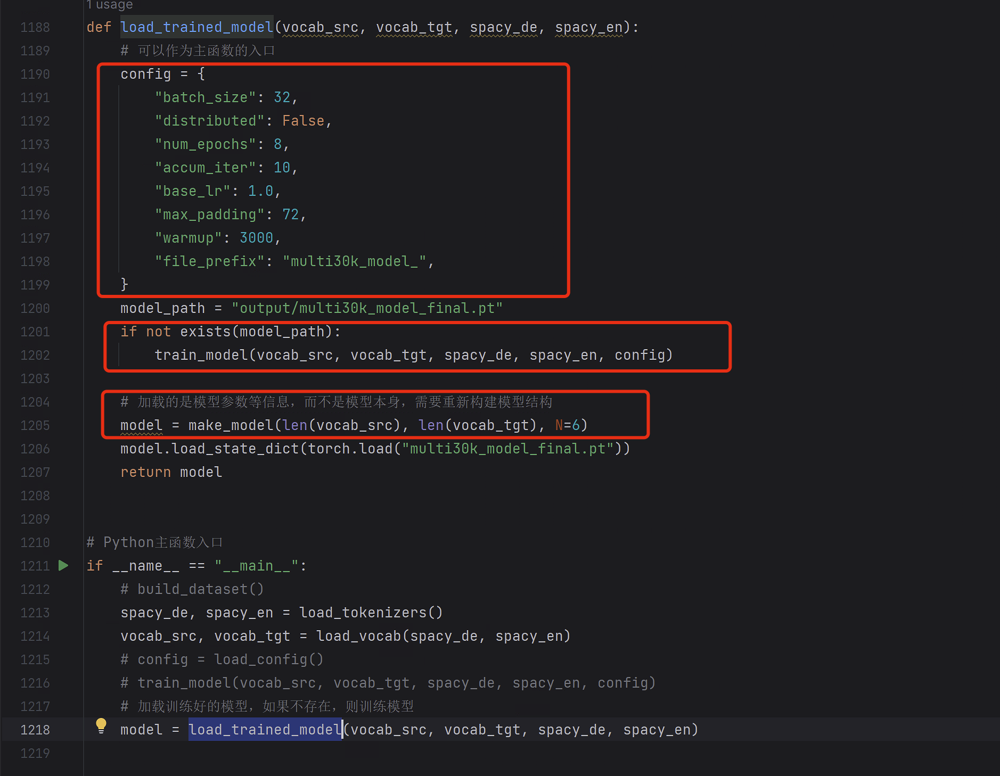
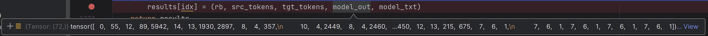

# 1数据准备

## 1.1分词器模型下载

1. 此处使用`spacy`的分词器模型对数据进行分词，因此需要下载；版本要和使用的`spacy`版本一致，即`3.2.0`版本；下载地址如下：

   1. `en_core_web_sm-3.2.0`：https://github.com/explosion/spacy-models/releases/tag/en_core_web_sm-3.2.0
   2. `de_core_news_sm-3.2.0`：https://github.com/explosion/spacy-models/releases/tag/de_core_news_sm-3.2.0

2. 先将这两个模型的压缩包下载下来，然后使用如下命令进行安装

   ```python
   # en_core_web_sm-3.2.0
   pip install E:\temp_files\en_core_web_sm-3.2.0.tar.gz
   # de_core_news_sm-3.2.0
   pip install E:\temp_files\de_core_news_sm-3.2.0.tar.gz
   ```

   

   
   
   

## 1.2加载分词器对象

1. 通过下面的语句加载德语和英语分词器对象

   ```python
   spacy_de, spacy_en = load_tokenizers()
   ```


## 1.3构建词汇表

1. 在没有构建词汇表的情况下，将调用`build_vocabulary`方法

2. 如下语句将下载数据集并将返回值分成训练、验证和测试集

   ```python
   train, val, test = datasets.Multi30k(language_pair=("de", "en"), root='data/')
   ```

   1. `root='data/'`：自定义了下载下来的数据集存放的位置，这里是当前文件所在目录中的`data`文件夹下面
   2. 注意：先可以运行一下，让程序下载数据集；直接debug的话，数据集可能下载不下来。
   3. 由于一些原因，这里提供的下载数据集的方法已经无法完全下载数据了(即下载下来的数据量和例子里面说的数据量对不上)
      1. 详见这里：[Could not get the file at http://www.quest.dcs.shef.ac.uk/wmt16_files_mmt/training.tar.gz. [RequestException\] None. · Issue #96 · harvardnlp/annotated-transformer · GitHub](https://github.com/harvardnlp/annotated-transformer/issues/96)
      2. 在上述链接中有人自己制造了一个数据集，因此本文就按照这个人做的数据集来实验，链接为：[Annotated_Transformer_Clone - Colaboratory (google.com)](https://colab.research.google.com/drive/131hohvAKRqzHg4K3_68UGL4oi4SGOB45?usp=sharing#scrollTo=4XVRz1goBrQb)

3. 处理前数据集下载地址：[Europarl Parallel Corpus (statmt.org)](https://www.statmt.org/europarl/)

   1. 下载好后，解压，然后放到项目里去，这里就放到了`E:\pycharmExperiments\transformer_annotated_paper\dataset`目录下

4. 从下载下来的数据集中读取数据，并打包成句子对

5. 切片，获取训练集、验证集和测试集

6. 这里将读取数据的过程封装在了`build_dataset`函数中

   

7. 构建词汇表

   1. 在`build_dataset`中返回三个数据集，然后增加下面的语句（<font color="red">从这里开始录视频</font>）

      ```python
      train, val, test = build_dataset()
      ```

   2. 调用`build_vocab_from_iterator`构建德语词汇表：从一个迭代器中构建一个词汇表，返回一个`torchtext.vocab.Vocab`对象，表示构建好的词汇表

      1. 第一个参数`yield_tokens`就是一个迭代器
         1. 将三个数据集相加（列表相加），得到一个列表，作为一个可迭代对象传入`yield_tokens`；同时传入德语分词器模型`tokenize_de`，以及要对德语还是英语进行分词的`index`参数
         2. 调用逻辑为：
            1. 在`yield_tokens`函数中，会遍历`data_iter`这个列表，对于每一个`from_to_tuple`，它是一个元组，元组中是德语-英语句子对，使用`index=0`表示这里要对德语进行分词，因此使用`from_to_tuple[index]`获取每一个德语文本
            2. 然后使用`tokenizer`函数，即传入进来的`tokenize_de`函数，也即`tokenize`函数进行分词(使用的是`spacy_de`分词器模型)，最终就是使用`spacy_de`的`tokenizer`方法进行分词，然后返回分词列表
      2. 第二个参数`min_freq`：一个整数，表示词汇表中的词汇在迭代器中出现的最小次数。如果一个词汇在迭代器中出现的次数小于`min_freq`，那么它将不会被加入到词汇表中
      3. 第三个参数`specials`：一个字符串列表，表示特殊的词汇，如`<s>`、`</s>`、`<blank>`和`<unk>`(表示未知的词汇，为了处理未知的词汇，我们通常会将它们替换为一个特殊的标记，例如`<unk>`)等
         1. `specials`参数提供的特殊词汇会被添加到词汇表的开头，并按照它们在`specials`参数中出现的顺序进行排序
         2. 例如这里，词汇表的前四个词汇分别为`<s>`、`</s>`、`<blank>`和`<unk>`，它们的索引分别为`0`、`1`、`2`和`3`
      4. 注意，这里`yield_tokens`是一个迭代器，在`build_vocab_from_iterator`中会根据迭代器进行具体的操作，和之前演示的数据合成过程类似，这里也是交替的运行程序，即不是将`yield_tokens`中的循环执行完毕再去执行`build_vocab_from_iterator`中的操作
         1. `build_vocab_from_iterator`方法中，在执行`for tokens in iterator:`循环时，每循环一次，都会调用一次`yield`生成器函数，即调用一次`yield tokenizer(from_to_tuple[index])`

   3. 最终得到的`vocab_src`是一个`Vocab`对象，如下图所示(德语词汇表)

      
   
   4. 同理得英语词汇表
   
      
   
   5. 然后将词汇表的默认索引设置为`<unk>`，当模型在处理输入时遇到未知的单词时，会将其索引设置为`<unk>`的索引。这样做的目的是为了避免模型在处理未知单词时出现错误
   
   6. 然后保存词汇表
   
      1. `torch.save`函数：是PyTorch中用于将模型、张量和字典等Python对象保存到磁盘上的函数
         1. 第一个参数`obj`：是要保存的Python对象，可以是模型、张量、字典等任何Python对象，这里是一个元组，元组第一个元素是德语词汇表，第二个元素是英语词汇表
         2. 第二个参数`f`：是保存对象的文件名或文件对象。这里文件名是：`vocab.pt`
   
   7. 如果已经创建过词汇表，则存在`vocab.pt`，直接读取，并将元组中的德语词汇表和英语词汇表分别赋值给`vocab_src`, `vocab_tgt`。（怎么存进去的，读出来就是什么样的）
   
      
   
   8. 最后，将词汇表返回。
   
      

# 2非分布式训练过程详述

1. 将调用`train_worker`函数，其中`gpu`和`ngpus_per_node`的主要是在分布式训练时起作用
   1. 由于这里是非分布式训练，因此`gpu=0`表示使用第`0`块GPU进行训练
   2. `torch.cuda.set_device(gpu)`：具体通过这句话实现。用来设置当前进程使用的GPU设备。由于是非分布式，因此全部的训练都是在`GPU 0`上进行的

## 2.1创建模型等

1. 设置相关参数并构建transformer架构的模型，然后将模型移动到指定的GPU设备上进行计算

   1. `pad_idx`：填充符在词表中的索引，其在`src`和`tgt`中的索引是一样的，如下图所示

      

   2. `d_model = 512`

   3. 构建transformer模型：将`src`和`tgt`的词表长度传入transformer，用于`embedding`以及最后由`d_model`转换为词表大小的`generator`类的操作，如下图所示

      

2. 将模型复制一份，完全一样；并设置当前进程为主进程(因为是非分布式训练，所以就一个进程)

   

3. 当前为非分布式训练，因此暂不考虑下面的关于分布式的处理

4. 构建标签平滑对象(包含损失计算函数)，并移动到GPU上

   1. 传入目标词汇表的大小
   2. 传入填充符索引，这里填充符的索引是`2`
   3. 设置平滑因子`0.1`

## 2.2创建数据导入器

1. 调用`create_dataloaders`时传入的参数

   1. `batch_size`：将`batch_size`除以`ngpus_per_node`是为了在多GPU训练时，每个GPU上的`batch_size`保持一致。例如，如果`batch_size`为`128`，`ngpus_per_node`为`4`，则每个GPU上的`batch_size`为`32`。这样可以确保每个GPU上的训练数据量相同，从而保证训练的公平性和稳定性。
      1. 但这里只是单个GPU，但也不影响
      2. 这里`batch_size=32`
   2. `max_padding`：最大填充设置为`72`

2. 同样需要调用`build_dataset`来读取数据，之前读取数据是因为需要构建一下词汇表。

3. 接着，构建训练集和验证集采样器

   1. 这里训练集和验证集采样器，即`train_sampler`和`valid_sampler`主要是在分布式训练时使用

   2. 为了考虑到分布式训练的需求，这里使用了三元表达式，在单卡训练的情况下，采样器为`None`，即不起作用(这个时候起作用的就是`shuffle`参数，即打乱)

   3. 在此之前还使用`train_iter_map = to_map_style_dataset(train_iter)`语句的大概原因：

      1. `DataLoader`默认使用`map-style`类型的数据集，而这句话的作用就是将`Iterable-style`数据集转换成`map-style`类型的数据集

      2. `map-style`数据集还可以通过实现`len`方法来支持`len()`函数，以便直接获取数据集的长度；

      3. 而`Iterable-style`数据集是一种通过迭代器的方式获取数据的数据集，它不支持直接获取数据集的长度。这是因为在使用迭代器获取数据时，数据集的长度是未知的，只有在迭代完整个数据集后才能确定其长度

      4. 另外，`DistributedSampler`类的第一个参数必须是`map-style`类型的数据集。`DistributedSampler`需要知道数据集的长度，以便在分布式训练时对数据进行划分

         

4. 然后构建训练集和验证集的数据加载器

   1. 传入的`train_iter_map`和`valid_iter_map`都是上面说的`map-style`类型的数据集
   2. `shuffle=(train_sampler is None)`：当是分布式训练时，`train_sampler`不为`None`，因此`shuffle=False`；反之，`shuffle=True`
   3. 使用`collate_fn`参数指定了一个函数`collate_fn`，即会调用`collate_batch`对一个batch中的数据进行一些处理
   4. 但是需要注意的是，这里只是先传入一些参数，然后构建出`train_dataloader`和`valid_dataloader`这两个`DataLoader`的对象，并没有对数据进行一些处理（可通过打断点查看程序运行过程来发现这一点）

5. 返回创建好的`train_dataloader`和`valid_dataloader`，如下图所示

   1. 可以看到，返回的数据导入器包含了一系列的信息，其中`batch_sampler`中的`3125`表示要采样`3125`次，因为训练数据总共`100000`条，一批的大小是`32`,`32*3125=100000`。(<font color="red">后面想录一个关于dataloader的详细笔记讲解</font>)

      

## 2.3创建优化器调度器等

1. 使用`Adam`构建自适应学习率优化器，并创建学习率调整的调度器

   1. 复制任务的例子中，也实际说明了，创建了学习率调度器之后，就对学习率进行了调整。这里也是一样的，因此学习率不是`optimizer`中的`1.0`，而是下图所示的大小。

      

2. 创建一个记录训练状态的类：`train_state`

## 2.4训练

1. 总共训练`8`个epoch

2. 将模型设置为训练模式，调用`run_epoch`函数进行每一代的训练。进入`run_epoch`函数之后：
   1. 前面说，创建`dataloader`时，不会去读取数据，那么这里则会先进入到`run_epoch`函数中，然后在遍历一个batch的数据的时候，从`train_dataloader`中读取第一批数据，然后，调用`Batch`类生成包含掩码矩阵等信息的Batch对象。调用顺序如下图所示。
   
      <video id="video" controls="" src="transformer_a_real_example.assets/2023-07-12 21-19-53.mp4" preload="none">
   
   2. 从`train_dataloader`中抽取`32`条数据作为一个batch之后，使用`collate_fn`，即`collate_batch`函数进行处理：
   
      1. 定义两个Tensor，一个是句子开始符的索引，一个是结束符的索引
   
      2. 然后遍历这一批`32`条数据中的每个数据，对于其中的`src`，先进行分词，然后获取其在词表中的索引信息，形成一个Tensor，然后和开始符以及结束符的两个Tensor连接起来，组成一个加入了开始符合结束符的`src`序列的索引形式的序列；其中，`torch.cat`的第二个参数指定为`0`是因为，这里的三个待连接的Tensor都是一维的，因此在第`0`维度(下标从`0`开始)进行连接。如下是连接过程的截图：
   
         1. 如下是`src`
   
            
   
         2. 如下是对`src`的分词结果，长度是`18`
   
            
   
         3. 如下是转换成索引之后的
   
            
   
         4. 如下是连接之后的，长度是`20`
   
            
   
      3. 对于这个Batch中的`tgt`，也是一样的操作，转换成索引序列。可以看到，这条数据，德语序列的长度是`20`，英语序列的长度是`24`
   
         
   
      4. 接下来对`src`进行填充，需要用到`pad`函数，`pad`函数是PyTorch中的一个函数，用于对张量进行填充。
   
         1. 它的第一个参数是要填充的张量，这里是`processed_src`
   
         2. 第二个参数是一个元组，表示在每个维度上要填充的数量。这里`processed_src`只有一个维度，所以维度指定为`0`，然后填充的数量是最多填充的数量减去`processed_src`的长度
   
            1. 根据这里填充数量的计算，可以知道，填充之后的序列的长度是固定值，即`max_padding`的值
   
            2. 这里`max_padding - len(processed_src)`也可能是负数，此时会造成部分数据的丢失，即从这个例子中可以发现，当待填充序列的长度大于最大填充数量的时候，序列将被截断。因此`max_padding`既是用计算需要填充的数量的，也是序列的固定的长度。
   
               
   
         3. 第三个参数是填充的值。这里是填充符对应的索引，即`2`
   
         4. 如下是长度小于最大填充数量的时候，填充的结果
   
            
   
      5. 同理，对`tgt`进行填充处理
   
      6. 最后，构建符合模型输入的`src`和`tgt`，以元组形式返回
   
         1. `torch.stack`函数：将一系列张量沿着一个新的维度进行堆叠，默认沿着第`0`个维度
         
         2. 这里的`src_list`是一个数据列表，长度是`32`，因此堆叠之后就变成了`(32,72)`，即`(batch_size,max_length)`。如下图所示
         
            
   
   3. 然后传入`Batch`类，构建`src`以及`tgt`的掩码张量（构建过程在复制任务中已经描述过了），结果如下图所示：
   
      
   
   4. 然后输入到transformer中进行前向计算，得到下图的结果。模型输出的维度是`(32,71,512)`
   
      
   
   5. 然后计算损失，下图是损失计算的类
   
      
   
   6. 然后计算梯度，记录训练信息
   
      1. 从下图可以看出，生成的两个损失中，`loss_node`包含`grad_fn`，而`loss`不含有此项，因此在计算梯度的时候使用的是平均损失`loss_node`。（<font color="red">后面可以去了解一下Tensor里面的`grad_fn`属性</font>）
   
         
   
      2. 记录训练信息的`train_state`类，是先在`train_worker`函数中创建的，因此这一个epoch结束之后，`train_state`仍然存在，一直记录训练信息的（这一点不同于复制任务例子中的设置，此处设置更加合理）。
   
   7. 达到累计的步数之后，就对参数进行更新
   
      1. 注意步数`step`和迭代数`epoch`的区别：每用一个批次的数据进行一次计算，就是一个`step`，而一个`epoch`中会对所有的数据进行计算，因此一个`epoch`中`step`的增加量相当于总的数据量除以`batch_size`
      2. 注意`n_accum`和`train_state.accum_step`的区别：在复制任务的例子中，两者不存在区别，但是在这里，由于`train_state`类，是先在`train_worker`函数中创建的，因此两者的区别显现出来了：
         1. `n_accum`：每调用一次`epoch`就会重新初始化为`0`，因此作用是在一个`epoch`中，记录参数更新的累计次数；在打印日志信息的时候会进行输出。
         2. `train_state.accum_step`：记录整个训练过程中，参数更新的次数。
   
   8. 然后进行一次学习率的调整
   
   9. 计算累计的损失`total_loss`和累计的有效token数(`tgt`中的)`total_tokens`。
   
   10. `tokens`的作用：每个epoch都会清零；在训练的时候，会打印日志信息，因此主要作用是：用于计算上次打印日志信息之后到这次输出日志信息时(即每`40`个Batch)，单位时间内处理的token数；因此输出一次日志信息之后也会清零。
   
   11. 打印训练时的日志信息(日志信息详细描述在复制任务中已经讲过了)
   
   12. 然后返回。这里在`train_worker`中，`run_epoch`返回后，只接收了训练状态信息。
   
       1. 下图是第一个epoch中训练之后接收到的`train_state`的信息
   
          
   
   13. 然后打印GPU的使用信息
   
   14. 然后保存这个epoch中训练结束的时候，模型的状态信息
   
       1. `state_dict()`方法：用于返回一个包含模型所有参数的字典。这个字典的键是参数的名称，值是对应的参数张量
   
   15. 清空GPU上的数据缓存
   
       1. `torch.cuda.empty_cache()`：用于清空当前GPU上的内存缓存的函数。在使用PyTorch进行深度学习训练时，由于模型和数据的规模较大，会占用大量的显存。当显存不足时，程序会崩溃。为了避免这种情况的发生，可以使用 `torch.cuda.empty_cache()` 函数来清空显存缓存，以便释放一些显存空间。但是，这个函数的使用应该谨慎，因为它会导致程序的运行速度变慢(即数据都清除掉了，下次再计算还要全部重新加载)。

## 2.5评估

1. 评估也是调用`run_epoch`函数，详细的过程在复制任务的例子中已经进行了描述。

2. 这里，只接收了`run_epoch`返回值中的平均损失数据，因为评估时也不存在训练状态信息，并且也不需要关注训练状态信息；而上面训练时，需要关注训练的信息。需要指出的是，这个例子中，并没有在训练结束之后接收损失的数据，因为这里在更新参数时并没有利用损失数据，但是有一些算法会在梯度下降和更新参数时考虑上一次模型的损失，那个时候就需要接收了。

3. 打印评估模式下模型的损失
   1. 这里只是单纯的打印了一下
   2. 实际使用时，可能会记录所有的评估的损失值，做个图啥的。

4. 最终，等所有的epoch都迭代完成之后，将最后的模型参数保存下来，供预测使用。如下图所示。

   

# 3加载训练好的模型

1. 在加载模型参数等信息前，需要先构建出模型架构
2. 如果不存在训练好的模型，则先训练模型(这里将之前训练时的`config`以及训练入口都放到了`load_trained_model`中)



# 4使用验证集数据来检查模型的输出

1. 这里使用训练好的模型进行预测时，使用的是cpu，因此上面加载模型的地方，导入模型的时候也做了如下图所示的调整：

   

2. 然后将`run_model_example`中导入模型的部分注释掉，也注释掉了`global vocab_src, vocab_tgt, spacy_de, spacy_en`，并修改了`run_model_example`的形参列表，并在主函数入口部分做了对应的修改，如下图所示：

   

   

3. 在这里，加载模型，将模型加载到了CPU上

## 4.1加载待预测数据

1. 预测数据来源于验证集
   1. 将数据集加载到CPU上
   2. `batch_size=1`：一条一条的预测
   3. `n_examples=5`：因此这里只预测验证集中的5条数据
2. 接下来进入`check_outputs`进行预测

## 4.2预测

1. 定义一个存放模型输出结果的列表`results`，长度为 `n_examples`，其中每个元素都是一个空元组，然后用一个循环来预测`n_examples`个数据

2. `b = next(iter(valid_dataloader))`：`iter` 函数用于将 `valid_dataloader` 转换为一个迭代器，`next` 函数用于从迭代器中取出一个元素`b`，这里就是一个 batch 的数据，也即`1`条数据

   1. 在训练时，是使用`for b in train_dataloader`来获取dataloader中的一批数据的，和这里的`next`方式稍微不同

3. 使用这一批数据构建一个Batch对象。如下图所示

   1. `src`的维度是`(1,128)`，即一条数据，长度是`128`(填充之后的)
   2. `src_mask`的维度是`(1,1,128)`：表示一条数据，这条数据的掩码张量维度是`(1,128)`
   3. `tgt`的维度是`(1,127)`，即一条数据，长度是`127`，因为去掉了目标语言句子中的结束符
   4. `tgt_mask`的维度是`(1,127,127)`，即一条数据，这条数据的掩码张量维度是`(127,127)`
   5. `tgt_y`的维度是`(1,127)`，即一条数据，长度是`127`，因为去掉了目标语言句子中的开始符

   

4. 然后对源序列进行分词，便于之后输出展示

   1. `rb.src[0]`：获取了这一条数据所在的Tensor，并且是一维的，如下图所示

      

   2. `vocab_src.get_itos()`：返回一个列表，其中包含了源语言词汇表中所有单词的字符串形式

   3. 然后遍历这个Tensor里面的每个元素，如果不是填充符，就使用`vocab_src.get_itos()[x]`从列表中获取索引对应的字符

5. 然后输出展示，如下图所示

   

6. 接下来将待预测序列及其掩码张量传入`greedy_decode`，解码得到目标序列(解码的过程在复制任务中讲述过了)

   1. 对`greedy_decode`返回值使用`[0]`切片，是为了将原先的维度为`(1,72)`的`ys`变成维度是`(72,)`的一维的Tensor
   1. 输出维度是72是因为解码时的循环条件是for i in range(max_len - 1)

7. 将模型输出的索引转换成对应的字符串

   1. 首先遍历模型的输出，将其中的非填充符索引转换成字符，如下图所示

      

   2. 然后用空格将这些字符连接起来，如下图所示(注意到，这里的字符串中存在多个结束符标签，这可能是模型预测的结果)

      

   3. 然后用split函数对字符串进行分割，只进行一次分割，用结束符进行分割，对于分割后的结果，只取第一个字符串(这里就比较简单粗暴了)

      

   4. 因为第一个字符串的结束符在split的时候作为了分隔符，因此对于获取的最终的字符串，需要在最后再加上一个结束符

   5. 然后输出，输出的时候去掉了换行符

   6. 保存这一次的预测的相关信息

      1. rb：这个Batch对象的信息

         

      2. src_tokens：源序列的字符

         

      3. tgt_tokens：真实的目标序列的字符

         

      4. model_out：模型输出的值

         

      5. model_txt：模型输出转换之后的结果

         

   7. 最终输出了5个验证数据的翻译结果

      


# 问题

1. 训练的时候最大填充`max_padding`设置的是`72`，预测的时候对待预测数据设置的最大填充是`128`，而在预测解码时，即传入`greedy_decode`的参数中，最大长度(也即填充)给的又是`72`，这仨不一致，在预测的时候没关系吗？

# 其他链接

[Transformer (qq.com)](https://mp.weixin.qq.com/s/biFNBi8Efs5uDYEocwmqbg)

[explosion/spacy-models: 💫 Models for the spaCy Natural Language Processing (NLP) library (github.com)](https://github.com/explosion/spacy-models/)

[The Annotated Transformer (harvard.edu)](https://nlp.seas.harvard.edu/2018/04/03/attention.html)

[harvardnlp/annotated-transformer: An annotated implementation of the Transformer paper. (github.com)](https://github.com/harvardnlp/annotated-transformer/)

