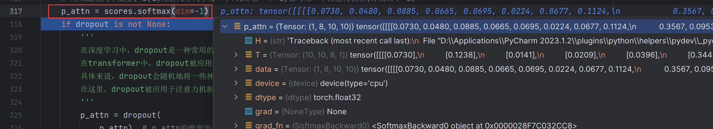
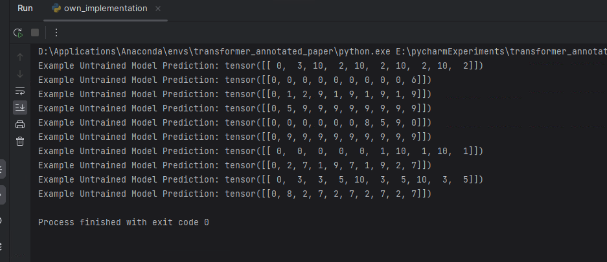

# 1评估模式下的前向计算过程

## 1.1从超参数构建模型

1. 相关超参数如下图

   1. 这里的`vocab`参数只是一个整数，表示词汇表的大小


   

### 1.1.1初始化多头注意力机制

1. 初始化结果如下图所示

   

2. 其中的线性层输入和输出的维度都是`d_model=512`

   

### 1.1.2初始化FFN

1. 包含两个线性层，第一个线性层的输入维度是`d_model=512`，输出维度是`d_ff=2048`，第二个线性层的输入维度是`d_ff=2048`，输出维度是`d_model=512`。如下图所示

   

2. 因此，`FFN`可以理解为一个具有三层结构（包括输入层）的神经网络，输入层和输出层都是`512`个神经元，中间的隐藏层是`2048`个神经元

3. 细看一下这里的线性层的结构

   

   1. 第一个线性层偏置的维度是`(2048,)`，第二个线性层的偏置的维度是`(512,)`。
   
      1. 根据神经网络的基本结构，隐藏层有`2048`个单元，因此输入层与隐藏层的每个单元相连接都代表式子：`wx+b`，则`2048`个单元需要`2048`个偏置。同理第二个线性层的偏置个数是`512`。
   
   2. 线性层相当于矩阵乘法，以简单的二维权重矩阵乘一维特征为例，输入维度为`(512,)`，根据`wx+b`及乘法法则，会将`(512,)`变成`(512,1)`，因此权重`w`的维度就需要是`(2048,512)`，这样才能保证矩阵乘法可行。
   
   3. 可以看到，初始化的时候会赋予权重矩阵和偏置一些值，<u>这些都是在训练时会被优化的参数</u>。
   
   4. 以下是线性层源码中关于偏置和权重维度的确定
   
      

### 1.1.3构建位置编码

1. 位置编码是不需要被优化的，这里初始化就等于是在给定相关参数的情况下固定了位置编码tensor

   

### 1.1.4构建整个模型

#### 1.1.4.1编码器


1. 包含2个编码器层(因为一开始的参数`N=2`)，以及一个层规范化

2. 每个编码器层的结构如下

   1. 1个自注意力层+1个FFN层+2个残差连接
   2. 自注意力层：4个线性层+1个dropout
   3. FFN层：2个线性层+1个dropout
   4. 残差连接：层规范化+dropout

   ```python
     (0): EncoderLayer(
       (self_attn): MultiHeadedAttention(
         (linears): ModuleList(
           (0): Linear(in_features=512, out_features=512, bias=True)
           (1): Linear(in_features=512, out_features=512, bias=True)
           (2): Linear(in_features=512, out_features=512, bias=True)
           (3): Linear(in_features=512, out_features=512, bias=True)
         )
         (dropout): Dropout(p=0.1, inplace=False)
       )
       (feed_forward): PositionwiseFeedForward(
         (w_1): Linear(in_features=512, out_features=2048, bias=True)
         (w_2): Linear(in_features=2048, out_features=512, bias=True)
         (dropout): Dropout(p=0.1, inplace=False)
       )
       (sublayer): ModuleList(
         (0): SublayerConnection(
           (norm): LayerNorm()
           (dropout): Dropout(p=0.1, inplace=False)
         )
         (1): SublayerConnection(
           (norm): LayerNorm()
           (dropout): Dropout(p=0.1, inplace=False)
         )
       )
     )
   ```


#### 1.1.4.2解码器


1. 和编码器一样，包含2个解码器层(因为一开始的参数`N=2`)，以及一个层规范化

2. 和编码器一样，只不过多了一个`src_attn`层，但大体的结构和`self_attn`一样；因为解码器每层有三个模块，因此残差连接层也变成了3个

   ```python
   (0): DecoderLayer(
       (self_attn): MultiHeadedAttention(
         (linears): ModuleList(
           (0): Linear(in_features=512, out_features=512, bias=True)
           (1): Linear(in_features=512, out_features=512, bias=True)
           (2): Linear(in_features=512, out_features=512, bias=True)
           (3): Linear(in_features=512, out_features=512, bias=True)
         )
         (dropout): Dropout(p=0.1, inplace=False)
       )
       (src_attn): MultiHeadedAttention(
         (linears): ModuleList(
           (0): Linear(in_features=512, out_features=512, bias=True)
           (1): Linear(in_features=512, out_features=512, bias=True)
           (2): Linear(in_features=512, out_features=512, bias=True)
           (3): Linear(in_features=512, out_features=512, bias=True)
         )
         (dropout): Dropout(p=0.1, inplace=False)
       )
       (feed_forward): PositionwiseFeedForward(
         (w_1): Linear(in_features=512, out_features=2048, bias=True)
         (w_2): Linear(in_features=2048, out_features=512, bias=True)
         (dropout): Dropout(p=0.1, inplace=False)
       )
       (sublayer): ModuleList(
         (0): SublayerConnection(
           (norm): LayerNorm()
           (dropout): Dropout(p=0.1, inplace=False)
         )
         (1): SublayerConnection(
           (norm): LayerNorm()
           (dropout): Dropout(p=0.1, inplace=False)
         )
         (2): SublayerConnection(
           (norm): LayerNorm()
           (dropout): Dropout(p=0.1, inplace=False)
         )
       )
     )
   ```

#### 1.1.4.3绑定embedding和position embedding

1. 使用`Sequential`容器依次放入`Embeddings`层和`Positional Encoding`层，这样模型在前向计算时，会按照顺序计算两个模块。`Sequential`的内部结构如下图所示。

   

#### 1.1.4.4最后的线性层及softmax

线性层输出维度是目标词汇表的大小，这样根据概率就可以确定当前待预测的词是哪一个


## 1.2对输入序列的编码

```python
# 执行语句如下
memory = test_model.encode(src, src_mask)
```

1. 该语句将依次进行`embedding`、`positional encoding`，之后进入`encoder`。

### 1.2.1嵌入及位置嵌入

1. 首先会执行`embedding`操作，将输入序列变成具有`512`个维度的嵌入，如下图所示：`src`从`(1,10)`变成了`(1,10,512)`。

   

2. 然后加入位置编码，`positional embedding`的第二个维度，即`max_length`是`5000`，需要和`src`的序列长度一致，如下图所示：

   

3. 位置编码前和位置编码后的`src`发生了变化，如下图所示。

   

### 1.2.2编码

1. 经过embedding操作之后，输入将被送入到`N`个编码器层

   

2. 实际进入到某一个编码器层时：

   
   
   1. 下面的语句会先进入到`SublayerConnection`函数中，然后先层规范化，再调用多头注意力函数，再进行残差连接
   
      
   

#### 1.2.2.1多头注意力层之层规范化

1. 在计算注意力之前进行

2. 层规范化不改变`x`的维度

3. 整个维度变化如下图所示

   

#### 1.2.2.2多头注意力层之注意力层的计算

1. 调用注意力函数的时候，`q、k、v`都是输入`x`，如下图所示：

   

2. 用三个线性层（在初始化的时候三个线性层的权重和偏置都是不一样的）分别对`q、k、v`做线性变换

   1. 变换之后的`q、k、v`数值上已经不一样了
   2. 且要进行维度的调整（分成`8`个头，每个头`64`个维度）
   3. 如下图所示

   

3. 计算attention（使用Tensor实现并行计算）

   1. `q`和`k`做Tensor乘法，并进行缩放，得到`(1,8,10,10)`维度的`scores`，即对于输入序列的每一个词，都有一个向量，向量中的元素表示当前词对输入序列中所有的词的评分

   2. 然后进行mask操作（<u>编码器阶段，应该是不需要进行mask操作的</u>，这里的前向计算示例中mask也是全1，因而mask也就没起作用）

      

   3. 然后进行softmax，将评分转化为概率，概率即所谓的注意力。然后进行dropout防止过拟合。

      

   4. 然后将注意力矩阵与v相乘，得到上下文信息

      1. 维度变化情况：`(1,8,10,10) x (1,8,10,64)`。

         ```python
         return torch.matmul(p_attn, value), p_attn
         ```

         

      2. 维度变化的意义如下图所示：第一行与右侧所有的列乘完之后，就得到了：当前某一个词，综合了上下文信息之后，在dim的每一个维度上的取值

         

4. 因此，在attention计算完之后，返回值仍然用`x`来表示，`x`的维度是`(1,8,10,64)`（<u>同时处理一批的数据，也同时处理每一条数据的多个头，一次性完成了所有的attention的计算</u>）

   

5. 合并多个头的计算结果，合并之后`x`的维度变回`(1,10,512)`。

   

#### 1.2.2.3多头注意力层之残差连接

1. 之后，进行残差连接

2. 所以在代码中，层规范化、注意力、残差连接用一条语句完成了计算，最终输出的`x`维度还是`(1,10,512)`。

   

#### 1.2.2.4前馈神经网络层

1. 和多头注意力层计算过程类似，计算之后输入的维度仍然是`(1,10,512)`。

   

#### 1.2.2.5层规范化

1. 在完成`N`个编码器层的计算之后，再进行一次层规范化，并返回编码的结果。

   

## 1.3解码

### 1.3.1构建掩码矩阵

1. 刚开始解码，解码后的序列只有1个元素，所以此时的解码张量只有1个元素。

   

2. 将主对角线以上的元素保留，其余元素置为`0`，然后再通过`return subsequent_mask == 0`语句，最终的掩码矩阵就是：<u>主对角线及以下的元素全为`1`，其余元素全为`0`</u>。如下图所示。

   

### 1.3.2输出的嵌入过程

1. 和输入的嵌入过程一样，依次进行嵌入以及位置嵌入

   

   1. 因此，在进入解码器层计算之前，`output`变成了`(1,1,512)`。第二个维度为`1`是因为当前的输出序列只有一个元素。

      

### 1.3.3自注意力计算

先进行自注意力的计算，和编码时对输入序列的自注意力计算过程一样，然后解码器比编码器多了一个对编码器输出的注意力计算。如下图所示。


1. 将`output`的`embedding`经过层规范化，然后计算注意力：（和编码器过程一样）将输出复制三份（即`q、k、v`），然后用线性投影分成`8`个头，如下图所示

   1. `q、k、v`的第三个维度是`1`，因为此时待预测的是第一个词，长度只有`1`。

   

2. 进入`attention`函数中，首先计算得分：当前预测序列只有一个元素，因此评分函数维度为：`(1,8,1,1)`。

   

3. 判断是否要进行掩码：此时为预测第一个词，`mask`矩阵值为`1`，因此不需要进行遮蔽

   

4. 计算注意力权重：由于只有一个元素，`softmax`之后都是`1`。

   

5. 然后用注意力权重乘上`values`，得到新的`x`，这里的维度是`(1,8,1,64)`，即当前预测序列的每个词，综合了上下文信息之后，得到的新的特征。合并之后的维度是`(1,1,512)`。

   

### 1.3.4编码器堆栈注意力计算

```python
# 第二个残差连接模块作用在新增子层上，有memory的参与
x = self.sublayer[1](x, lambda x: self.src_attn(x, m, m, src_mask))
```

这个子层注意力的计算，`query`张量是输出序列经过注意力层计算得来的，而`key`和`values`则是输入序列经过编码器层编码得来的，且此时使用的`mask`矩阵是输入序列的`mask`矩阵。


接下来就和一般的注意力过程一样，计算得分、进行mask、softmax。**<u>mask操作的具体分析后续进行</u>**。

### 1.3.5解码结果

1. 经过注意力计算、FFN之后，得到的输出如下图所示，输出的维度是：`(1,1,512)`。

   

2. 然后生成当前位置的预测：

   1. 由于解码过程是自回归的，且需要考虑先前的位置，因此随着预测的进行，`out`的维度至少会变为：`(1,m,512)`，但是预测的时候只需要取最后一个位置的特征，因此需要使用`out[:, -1]`。

   2. 然后再对这个待预测的位置的特征进行线性变换（将维度从`d_model`变成了`tgt_vocab`），然后进行softmax（注意这里使用的是log_softmax，但是根据对数函数的单调性，原来在(0,1)之间的各个概率就变成了小于0的数，但是用softmax计算出来的概率大的，其对应的用log_softmax计算出来的值也就相应的大，所以之后采用取最大的那个对应的词作为待预测的词也是没有问题的）。

      

   3. 比如这里

      1. 由`torch.max(prob, dim=1)`得到概率最大的位置对应的下标（即**<u>在目标词典中的位置</u>**）为`2`，即图中的`tensor([2])`。
      2. 将这个位置对应的tensor取出来，即`next_word = next_word.data[0]`，得到`tensor(2)`。

      

   4. 然后，就得到了新的输出序列：

      ```python
      # 1、先用一维的tensor来存储预测的值
      xxx=torch.empty(1, 1).type_as(src.data).fill_(next_word)
      xxx.size()
      Out[6]: torch.Size([1, 1])
      # 2、然后和上一轮的输出ys一起存储为列表
      [ys, torch.empty(1, 1).type_as(src.data).fill_(next_word)]
      Out[7]: [tensor([[0]]), tensor([[2]])]
      # 3、然后将两者合并为一个tensor
      ys = torch.cat(
                  [ys, torch.empty(1, 1).type_as(src.data).fill_(next_word)], dim=1
              )
      Out[8]: tensor([[0, 2]])
      ```
      
      1. 因此，写到这里，可以发现，这里的评估模式下的运行过程：<font color="red">是在已知`ys`的第一个位置的词的情况下（即`ys=tensor[[0]]`），去预测后续的位置的词。</font>
      
      2. 而当`i=0`时，表示预测第二个位置的词，按照论文所说，预测第二个位置的词的时候，只会去考虑第一个位置的信息，而忽略待预测位置及之后的位置，那么此时的`tgt_mask=1`，于是就没有屏蔽第一个位置
      
      3. 当输出序列中已经存在至少2个词的时候，计算注意力值时就会是下面的情况：
      
         

### 1.3.6掩码操作具体分析

> 此处分析一下输出序列大于1个元素的时候，mask的操作是怎么样的。

1. 当`i=2`时，是预测第4个位置，因此`ys`已经有三个值了，如下图所示：

   

#### 1.3.6.1自注意力

1. 注意到，此时的`tgt_mask`已经变成下面的矩阵了：

   ```python
   [
     [1,0,0],
     [1,1,0],
     [1,1,1]
   ]
   ```

2. 因此评分Tensor的主对角线以上的元素都会变成很小的负数，softmax之后对应的概率就会趋近于0

   

3. 最后和`values`相乘时，输出序列每个位置只会考虑自己的位置及之前的位置。

4. 注意这里是输出序列的自注意力，经过自注意力（<u>每个位置都去计算了上下文信息，其实只有上文信息</u>）之后，得到了考虑了输出序列上下文信息的`x`，去和编码器的输出进行“编码器堆栈注意力”。

## 1.4最终结果

最终会得到下图所示的多次预测的结果。



# 相关文章

[PyTorch中Linear层的原理 | PyTorch系列（十六）_flyfor2013的博客-CSDN博客](https://blog.csdn.net/flyfor2013/article/details/106485329)

[nn.Sequential()_一颗磐石的博客-CSDN博客](https://blog.csdn.net/Just_do_myself/article/details/124195393)

